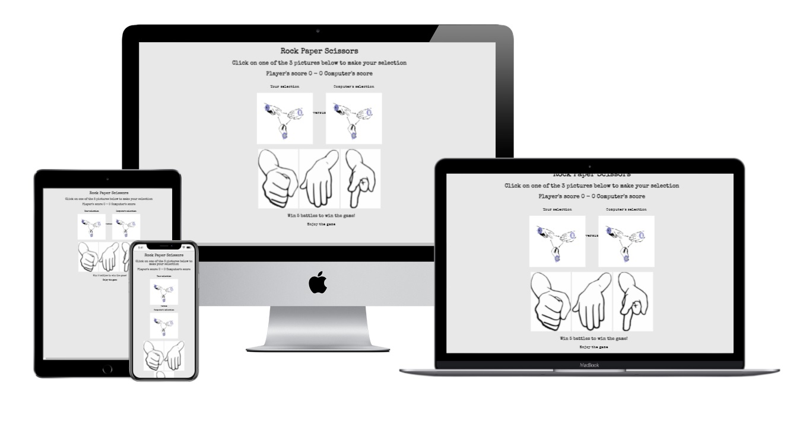
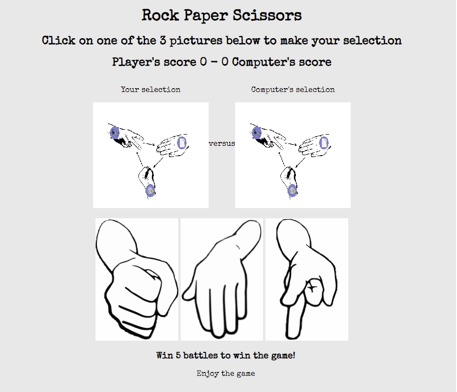
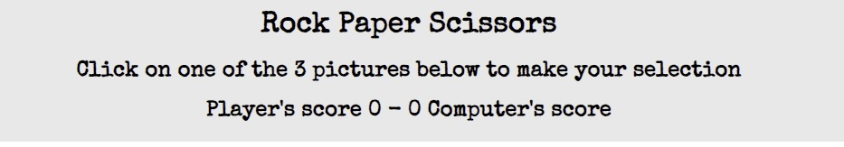
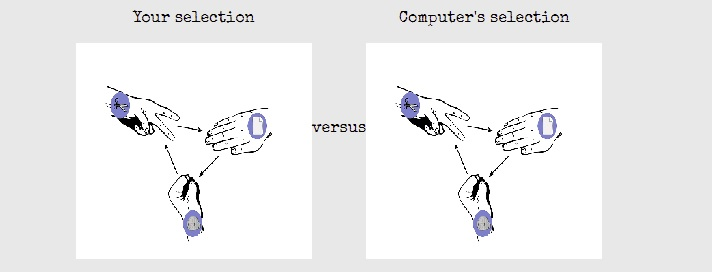
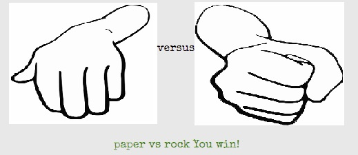
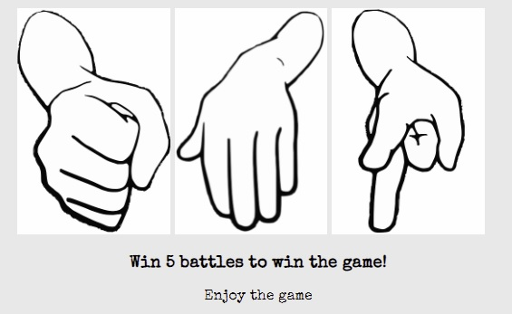
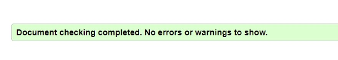
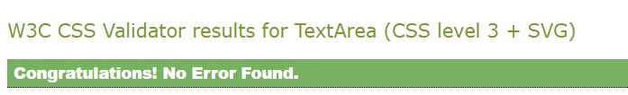
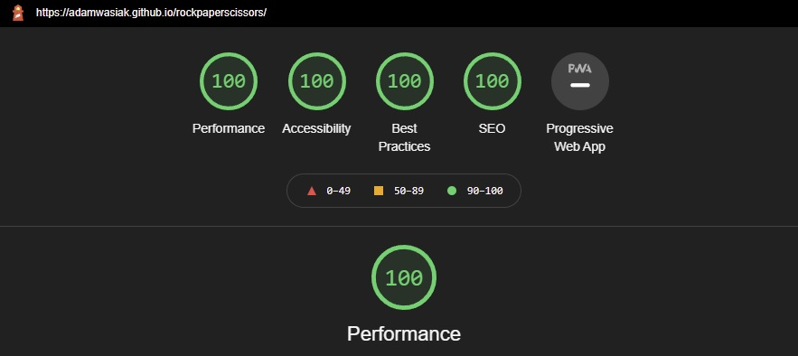
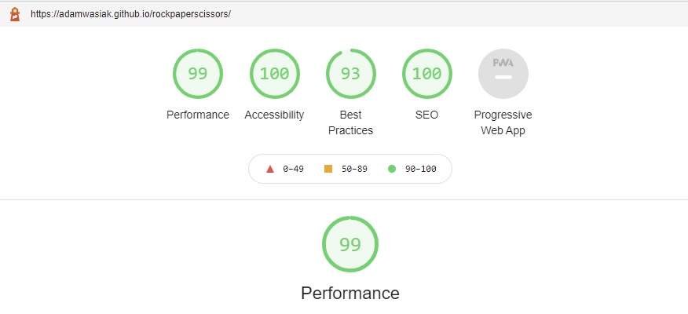

# Rock Paper Scissors Game by Adam Wasiak
Simple online rock paper scissors game.
Quick and simple entertainment.

Please visit the website in [here](https://adamwasiak.github.io/rockpaperscissors/)

## Milestone Project 2
### Purpose 
This simple online game was created for the purpose of completing the second Milestone Project for the Code Institute's Diploma in Software Development (E-commerce Applications). The website was built using the knowledge gained from the HTML, CSS Modules as well as recently JavaScript content of the course.
The target audience for this website are users who would like to avail of quick, simple online game of Rock Paper Scissors.
Whilst there are many varieties of this classic game available online, the objective of the website is also to attract user to game's visual appeal.

## User Experience Design  

The key objective of the game from user experience perspective was to keep it simple and visually appealing. 
The focus was on keeping the game visual with limited text content limited to key information.

## Game design 
The game consists of 1 page, the homepage, where the actual game play takes place. 

-**Concept**- the key concept was to create a simple, eye pleasing game, with a well-balanced contrasts and color, and also with good level of responsiveness to users' actions.

-**Colors and background**- the colors are primarily grey and black in terms of fonts and background.

-**Typography** – I have selected font “Special Elite” with sans-serif as a fall-back font for the entire content of the website. The specific font of “Special Elite” was sourced from Google Fonts library.

## Features 
### Game Page

**Rules and Scores Section**

**Selection Section**

**Message Section**

**Options Section**

## Future developments

## Testing 
Throughout the course of testing the following key test areas were focused on:

**Functional**
-The focus of functional testing was to ensure that the logic required was observed during the game and that the user experience remained in line with expectations. 
During testing the following aspects were reviewed:

1. upon selection of either paper, rock or scissors that the correct image was appearing in the player selection area
2. that the logic of declaring winning party at the comparison stage was correct 
3. that points were being added correctly upon user or computer being declared as winner of individual round
4. pop up messages (below Player and Computer selection areas) were also corresponding correctly to the outcome of the round
5. that after number of rounds, correct party with 5 point was being declared as winner

**Responsive user experience**

**Code validator testing**

The code itself was validated using HTML - W3C HTML Validator,CSS - Jigsaw CSS Validator and JavaScript - JSHint Validator
Results have been outlined below

**HTML index file**

The code validation process in W3C HTML Validator has not highlighted code errors.

**CSS file**

The code validation process in Jigsaw CSS Validator has not highlighted code errors.

**Lighthouse – Dev Tools**

*Desktop*

*Mobile*

**Bugs**

  **Fixed Bugs**
  
  - At the early stage of development it was noted that the JavaScript file was incorrectly linked to main index HTML file. Whilst the command for linkage was there however the     source for JS file was incomplete. This was noted and resolved in the process of project development.
  - After implementation of JavaScrip logic, the functions were not kicking in, which led to a need to review JavaScript code. It was subsequently identified that an "=" sign       was missing in one of the "if" statement, which prevented logi kicking in. This is now resolved.
  
  **Unfixed Busg**

 
## Deployment 
This project was created and worked using Code Institute Gitpod Full Template. Once the website was created it was deployed using GitHub.  The specific steps for the deployment were as follows:

1. Go to the repository of the project, once in GitHub
2. Go to settings
3. Go to GitHub Pages
4. Select the source branch as “main” and folder as “root” and click Save.
5. After few minutes the website was confirmed as published with the following user link: https://adamwasiak.github.io/rockpaperscissors/

## Credits

-Rock Paper Scissors image- credit to OpenClipart-Vectors- https://pixabay.com/vectors/fingers-fist-hands-paper-rock-149296/

-Paper image- credit to OpenClipart-Vectors- https://pixabay.com/vectors/rock-paper-scissors-paper-hand-296855/

-Scissors image- credit to OpenClipart-Vectors- https://pixabay.com/vectors/rock-paper-scissors-scissors-hand-296853/

-Rock image- credit to OpenClipart-Vectors- https://pixabay.com/vectors/rock-paper-scissors-rock-hand-296854/

Thanky you to Code Institute for excellent module content, Code Institue support team and my mentor Daisy for guidance and support.

