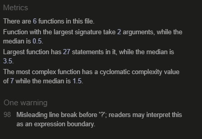

# Rock Paper Scissors Game by Adam Wasiak
Simple online rock paper scissors game.
Quick and simple entertainment.

Please visit the website in [here](https://adamwasiak.github.io/rockpaperscissors/)

## Milestone Project 2
### Purpose 
This simple online game was created for the purpose of completing the second Milestone Project for the Code Institute's Diploma in Software Development (E-commerce Applications). The website was built using the knowledge gained from the HTML, CSS Modules as well as recently JavaScript content of the course.
The target audience for this website are users who would like to avail of quick, simple online game of Rock Paper Scissors.
Whilst there are many varieties of this classic game available online, the objective of the website is also to attract user to game's visual appeal.

## User Experience Design  

The key objective of the game from user experience perspective was to keep it simple and visually appealing. 
The focus was on keeping the game visual with limited text content limited to key information.

## Game design 
The game consists of 1 page, the homepage, where the actual game play takes place. 

-**Concept**- the key concept was to create a simple, eye pleasing game, with a well-balanced contrasts and color, and also with good level of responsiveness to users' actions.

-**Colors and background**- the colors are primarily grey and black in terms of fonts and background.

-**Typography** – I have selected font “Special Elite” with sans-serif as a fall-back font for the entire content of the website. The specific font of “Special Elite” was sourced from Google Fonts library.

-**Rules** - The rules of the game are communicated to the user through a static messages on the website. For each round users must choose from one of the 3 options available.
The user selection is compared to automated computer's selection and a a winner of each round is declared in the message below selection section. There are 5 rounds and 5 wins required in order for a winner to be declared. At the end of 5th rounds winner (either user or computer ) is declared through appropriate message being displayed.

## Features 

### Game Page

The below reflects layout of the entire game page, which users upon visiting the webiste will experience.

### Rules and Scores Section

Each visitor/user is welcomed with the name of the game and simple instructions to follow to play the game. The section below also reflects game score area for both user and computer. Scores are updated after each round and will run up to winner reaches 5 rounds won.

### Selection Section

Upon visit on the website this section will display to user 3 options available to the users. Upon selection images will update to user's selection as well as computer's selection. The image changes will progress as the game continues.

### Message Section

After commencement of the game and after each round is played the below section will display selections made (in form of words) as well as the round winner is annouced. After 5 rounds the section will update with the message declaring the overall winner of the game.

### Options Section

In the below section user will have an opportunity to make a selection of their choice for each round played. The user will be making selection by clicking on the image of their choice.

## Future developments

Some of the key future developments are as follows:

1. The proportions of the images and overall layout of the game for desktops users will need to be improved. The improvement is specifically in relation to enlarging images and    spreading game elements more evenly.
2. Icon (such as Favicon) will need to be added to the website to create its own character.
3. In order to create additional wow factor an audio effect will need to be added at the time when the overall game winner is being declared.
4. The round winner messaages can be also improved in terms of visual effects such as words declaring winner displaying in bold.

## Testing 
Throughout the course of testing the following key test areas were focused on:

**Functional**
-The focus of functional testing was to ensure that the logic required was observed during the game and that the user experience remained in line with expectations. 
During testing the following aspects were reviewed:

1. upon selection of either paper, rock or scissors that the correct image was appearing in the player selection area
2. that the logic of declaring winning party at the comparison stage was correct 
3. that points were being added correctly upon user or computer being declared as winner of individual round
4. pop up messages (below Player and Computer selection areas) were also corresponding correctly to the outcome of the round
5. that after number of rounds, correct party with 5 point was being declared as winner

**Responsive user experience**

-Testing completed for responsive design for the following break point 1200px, 1024px,768px and for mobile at 320px.

-Media query at the break point of 540px has been incorporated in the code, at which point the selection images will stack inline as oppose to staying in a row.

-Testing for responsiveness was completed in Chrome Dev Tool. In addition the website was successfully tested on Ipad Mini device and desktop.
 Testing was also conducted on mobile device (Samsung A21s).

**Code validator testing**

The code itself was validated using HTML - W3C HTML Validator,CSS - Jigsaw CSS Validator and JavaScript - JSHint Validator
Results have been outlined below

**HTML index file**

The code validation process in W3C HTML Validator has not highlighted code errors.

**CSS file**

The code validation process in Jigsaw CSS Validator has not highlighted code errors.

**JavaScrip file**

The code validation process in JSHint Validator has not highlighted code errors. One warning has been displayed regarding question mark in the code.

**Lighthouse – Dev Tools**

Project was tested through Lighthouse tool for both mobile and desktop.

*Desktop*

*Mobile*

**Bugs**

  **Fixed Bugs**
  
  - At the early stage of development it was noted that the JavaScript file was incorrectly linked to main index HTML file. Whilst the command for linkage was there however the     source for JS file was incomplete. This was noted and resolved in the process of project development.
  - After implementation of JavaScrip logic, the functions were not kicking in, which led to a need to review JavaScript code. It was subsequently identified that an "=" sign       was missing in one of the "if" statement, which prevented logi kicking in. This is now resolved.
  
  **Unfixed Busg**
  
  - Although extensing testing, at the last moment prior to project submission, a potential bug has been identified. The bug seems to be impacting winner message color 
    when selection of the user is rock and computer's is scissors. Although correct winner is declared through the message, the expectation is that message will be 
    displayed in green whereas the message remains with black color.

 
## Deployment 
This project was created and worked using Code Institute Gitpod Full Template. Once the website was created it was deployed using GitHub.  The specific steps for the deployment were as follows:

1. Go to the repository of the project, once in GitHub
2. Go to settings
3. Go to GitHub Pages
4. Select the source branch as “main” and folder as “root” and click Save.
5. After few minutes the website was confirmed as published with the following user link: https://adamwasiak.github.io/rockpaperscissors/

## Credits

-Rock Paper Scissors image- credit to OpenClipart-Vectors- https://pixabay.com/vectors/fingers-fist-hands-paper-rock-149296/

-Paper image- credit to OpenClipart-Vectors- https://pixabay.com/vectors/rock-paper-scissors-paper-hand-296855/

-Scissors image- credit to OpenClipart-Vectors- https://pixabay.com/vectors/rock-paper-scissors-scissors-hand-296853/

-Rock image- credit to OpenClipart-Vectors- https://pixabay.com/vectors/rock-paper-scissors-rock-hand-296854/

-The project idea and concept was influenced by Code Institute's JavaScript Portfolio Project video as well as resource below:
https://sebhastian.com/rock-paper-scissors-javascript/

Thanky you to Code Institute for excellent module content, Code Institue support team and my mentor Daisy for guidance and support.

